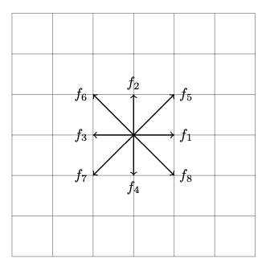

# Lattice Boltzmann Method (In progress)

Here is an example of a simulation of the lid-driven cavity problem using the Lattice Boltzmann Method, a numerical hydrodynamics algorithm stemming from kinetic theory.

# Theory

A classical system of interacting particles can be described at different levels. We can start with the Hamiltonian describing the particles, but it could be more enlightening. If we put additional constraints and abstractions, we can write down equations for the dynamics of the macroscopic variables, thoroughly washing out the particle picture. The Navier-Stokes equation describes the evolution of Newtonian fluids operating at this regime. 

The kinetic theory introduced a mesoscopic scale into this picture, in between the previous two scales, where we can find some new physics. The Boltzmann equation provides a statistical description for out-of-equilibrium systems, given by,

$$\frac{\partial f}{\partial t} + \frac{\boldsymbol{p}}{m} \cdot \nabla f + \boldsymbol{F} \cdot \frac{\partial f}{\partial \boldsymbol{p}} = \left( \frac{\partial f}{\partial t} \right)_{coll},$$

where $f$ is the single particle distribution in phase space described by the coordinates $\boldsymbol{r}$ and $\boldsymbol{p}$, $\boldsymbol{F} \left( \boldsymbol{r}, t \right)$ is the force field. The RHS gives the change of the distribution due to collisions.

The idea behind the Lattice-Boltzmann method is that a discretized version of the Boltzmann equation with an ad-hoc collision term can describe the evolution of the velocity field of a Newtonian incompressible fluid described by the Navier-Stokes equation. The approximation is reasonably accurate for low Reynolds number flows.

## Algorithm

We use the D2Q9 discretization in 2 dimensions, where there $9$ directions (including staying still) for the distribution to move on a grid. **Figure 1** shows the directions.

The density and the velocity field can be recovered as moments of this $9$ dimensional distribution as,

$$\rho \left( \boldsymbol{r}, t \right) =  \sum_{i = 0}^{8} f_{i} \left( \boldsymbol{r}, t \right) \text{, and,}$$

$$\boldsymbol{u} \left( \boldsymbol{r}, t \right) = \frac{c}{\rho} \sum_{i = 0}^{8} \boldsymbol{e}_{i}$$

where $\boldsymbol{e}_{i}$ is the direction associated with the $i$-th distribution and $c = \frac{\Delta x}{\Delta t}$ is determined from the space and time discretizations.

The algorithm only involves array movements and arithmetic, unlike other numerical hydrodynamics techniques. It consists of the streaming and collision steps and recovering $\rho \text{ and } \boldsymbol{u}$ after doing this.

### 1. Streaming

The streaming step is just translating the distributions in their respective directions.

<b> Figure 1. </b> Streaming step 

### Collision

In the collision step, the distributions are corrected to incorporate the local interactions through collisions, given by,

$$\Delta f_{i} \left( \boldsymbol{r}, t \right) = \frac{ f_{i} \left( \boldsymbol{r}, t \right) - f_{i}^{eq} \left( \boldsymbol{r}, t \right) }{\tau} .$$

$\tau$, the relaxation time (analogous to the time scale of collisions in kinetic theory), is a simulation parameter, and the equilibrium distribution,

$$f_{i}^{eq} \left( \boldsymbol{r}, t \right) = w_{i} \rho \left( 1 + \left[ 3 \frac{\boldsymbol{e_{i}} \cdot \boldsymbol{u}}{c} + \frac{9}{2} \frac{ \left( \boldsymbol{e_{i}} \cdot \boldsymbol{u} \right)^{2}}{c^{2}} - \frac{3}{2} \frac{|\boldsymbol{u}|^{2}}{c^{2}} \right] \right).$$

The weights, $w_{i}$, are $0$ for $i = 0$, $\frac{1}{9}$ for $i = 1, 2, 3, 4,$ and $\frac{1}{36}$ for $i = 5, 6, 7, 8.$ 

## Reynold's Number

The simulation parameters control Reynold's number, $Re$, through the kinematic viscosity,

$$\nu = \frac{2 \tau -1}{6} \frac{\left( \Delta x \right)^{2}}{\Delta t},$$
 
$Re = \frac{uL}{\nu}.$

Please note that the simulation will fail to remain incompressible as $Re$ increases. Also, it can become unstable for some values of $\tau$ and the choices of grid spacings.

## Example simulation

This is an example simulation of the Lid-Driven cavity, with the boundary conditions $\boldsymbol{u} \left( y = L  \right) = u_{0}$ and reflecting boundary conditions on the other three boundaries of a square of length $L$. Zou-He (see [On pressure and velocity flow boundary conditions for the lattice Boltzmann BGK model](https://arxiv.org/abs/comp-gas/9508001)) technique is used to enforce the top boundary condition. Reflective boundary conditions are readily employed by appropriately reflecting the $f_{i}$ s on the boundaries during the streaming step.

  <figure style="display:block margin: 0 auto 0.55em;">
      
  </figure>

