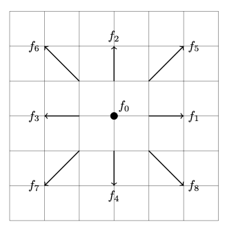

# Lattice-Boltzmann (In progress)

Here is an example of simulation of the lid-driven cavity problem using the Lattice Boltzmann Method, a numerical hydrodynamics algorithm, stemming from kinetic theory.

# Theory

A classical system of interacting particles can be descrived at different levels. We can start from the Hamiltonian describing the particles, but it is not particularly enlightening. If we put additional cosntraints and abstractions, we can write down equations for the dynamics of the macroscopic variables, completely washing out the particle picture. The Navier-Stokes equation describing the evolution of Newtonian fluids operate at this regime. 

Kinetic theory introduced a mesoscopic scale into this picture, in between the previous two scales, where some new physics can be found. The Boltzmann equation 

## Streaming

<figure class="half" style="display:flex">
    
    
    <figcaption> The sterming step </figcaption>
</figure>

## Collision

# Example simulation

  <figure style="display:block margin: 0 auto 0.55em;">
      
  </figure>

